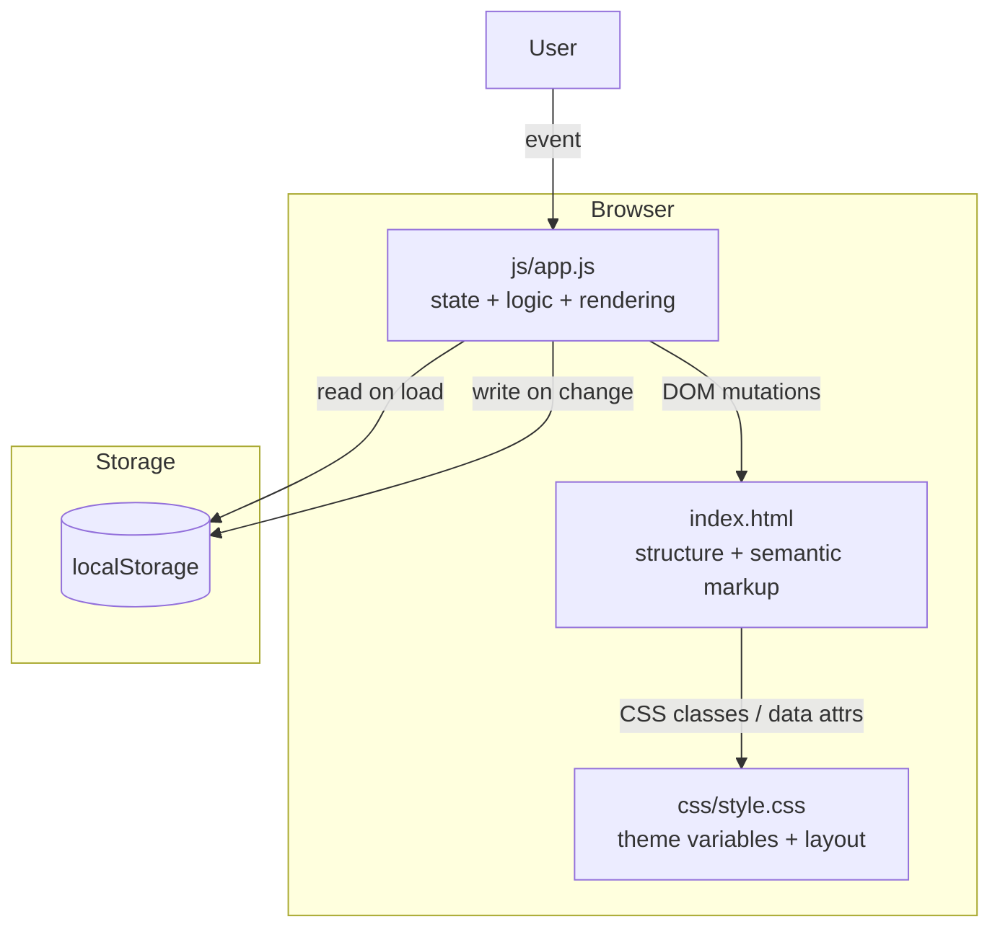
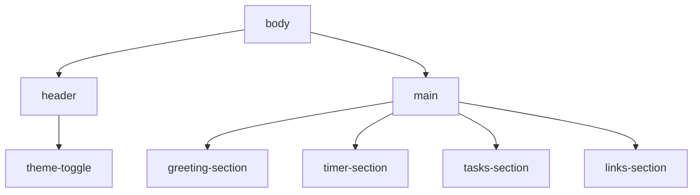

# Design Document: To-Do List Life Dashboard

## Overview

The To-Do List Life Dashboard is a fully client-side, single-page web application (SPA) built with plain HTML, CSS, and Vanilla JavaScript. It delivers four core widgets on one screen: a time-aware Greeting Widget, a configurable Focus Timer (Pomodoro-style), a Task Manager, and a Quick Links collection. All data is persisted exclusively via the browser `localStorage` API — no server, no build step, no frameworks.

The application targets modern desktop browsers (Chrome, Firefox, Edge, Safari) and must be openable by double-clicking `index.html` directly from the filesystem. Every interactive feature must work offline.

**In-scope challenges:** Light/Dark Mode, Configurable Pomodoro Time, Sort Tasks.

---

## Architecture

The application follows a **single-file JavaScript architecture** with a clear module pattern inside `js/app.js`. Because no bundler is used, modules are emulated via immediately-invoked function expressions (IIFEs) and a single shared `AppState` object. The rendering layer uses direct DOM manipulation rather than a virtual DOM.

### High-Level Data Flow



### Request / Response Cycle (client-only)

1. Browser opens `index.html`.
2. `<link>` loads `css/style.css`.
3. `<script defer>` loads `js/app.js`.
4. `app.js` reads `localStorage`, hydrates `AppState`, then calls `renderAll()`.
5. All subsequent changes flow: **User interaction → event handler → state mutation → re-render affected widget → `localStorage.setItem`**.

---

## Components and Interfaces

### File Structure

```
project-root/
├── index.html          # Single HTML page — semantic structure only
├── css/
│   └── style.css       # All styles, CSS custom properties for theming
└── js/
    └── app.js          # All JavaScript — state, logic, rendering
```

### HTML Layout (`index.html`)



The page uses semantic HTML5 elements (`<header>`, `<main>`, `<section>`, `<article>`, `<button>`, `<form>`) to ensure accessibility and clarity.

```html
<!-- Sketch of structural layout -->
<body data-theme="light">
  <header>
    <button id="theme-toggle" aria-label="Toggle dark mode">🌙</button>
  </header>
  <main>
    <section id="greeting-widget">…</section>
    <section id="timer-widget">…</section>
    <section id="task-widget">…</section>
    <section id="links-widget">…</section>
  </main>
</body>
```

The active theme is stored as a `data-theme` attribute on `<body>`, which CSS custom-property cascading targets.

### JavaScript Module Organization (`js/app.js`)

The single file is organized into clearly delimited sections with comment banners:

```
// ── 1. CONSTANTS & CONFIG ─────────────────────────────
// ── 2. APP STATE ──────────────────────────────────────
// ── 3. LOCAL STORAGE HELPERS ──────────────────────────
// ── 4. GREETING WIDGET ────────────────────────────────
// ── 5. FOCUS TIMER ────────────────────────────────────
// ── 6. TASK MANAGER ───────────────────────────────────
// ── 7. QUICK LINKS ────────────────────────────────────
// ── 8. THEME ──────────────────────────────────────────
// ── 9. INIT ───────────────────────────────────────────
```

#### Key Interfaces

**`AppState` (shared in-memory state)**

```js
const AppState = {
  tasks: [],          // Task[]
  links: [],          // Link[]
  timerDuration: 25,  // number (minutes, 1–120)
  sortOrder: 'default', // SortOrder
  theme: 'light',     // 'light' | 'dark'

  // Timer runtime state (not persisted)
  timerRemaining: null, // number (seconds)
  timerRunning: false,
  timerIntervalId: null,
};
```

**Storage Helper Interface**

```js
Storage.load(key, defaultValue)   // returns parsed value or defaultValue
Storage.save(key, value)           // JSON.stringify; swallows write errors
Storage.isAvailable()             // returns boolean
```

**Widget Render Functions**

| Function | Responsibility |
|---|---|
| `renderGreeting()` | Update time/date text nodes, re-evaluate greeting string |
| `renderTimer()` | Rewrite MM:SS display, toggle button states |
| `renderTasks()` | Re-render entire task list from `AppState.tasks` with active sort |
| `renderLinks()` | Re-render entire links collection from `AppState.links` |
| `renderTheme()` | Set `data-theme` on `<body>`, update toggle icon/label |
| `renderAll()` | Calls all of the above; used on initial load |

**Event Handler Naming Convention**

All event handlers are named `on<Widget><Action>`, e.g.:
- `onTimerStart()`, `onTimerStop()`, `onTimerReset()`
- `onTaskAdd(event)`, `onTaskEdit(id)`, `onTaskDelete(id)`, `onTaskToggle(id)`
- `onLinkAdd(event)`, `onLinkDelete(id)`
- `onSortChange(event)`
- `onThemeToggle()`
- `onTimerDurationChange(event)`

---

## Data Models

All data is serialized to JSON and stored under predictable `localStorage` keys.

### `localStorage` Key Registry

| Key | Type | Default | Description |
|---|---|---|---|
| `tld_tasks` | `Task[]` | `[]` | Ordered array of task objects |
| `tld_links` | `Link[]` | `[]` | Ordered array of link objects |
| `tld_timerDuration` | `number` | `25` | Timer duration in minutes (1–120) |
| `tld_sortOrder` | `SortOrder` | `"default"` | Active sort option identifier |
| `tld_theme` | `"light" \| "dark"` | `"light"` | Active color theme |

All keys are prefixed with `tld_` to avoid collisions with other apps on the same origin.

### `Task` Object

```js
/**
 * @typedef {Object} Task
 * @property {string}  id          - UUID v4 (crypto.randomUUID() or timestamp fallback)
 * @property {string}  description - 1–200 characters
 * @property {boolean} completed   - false on creation
 * @property {number}  createdAt   - Unix timestamp (ms), used for "Default" sort order
 */
```

### `Link` Object

```js
/**
 * @typedef {Object} Link
 * @property {string} id    - UUID v4
 * @property {string} label - 1–50 characters; displayed as button text
 * @property {string} url   - 1–2048 characters; must start with http:// or https://
 */
```

### `SortOrder` Enumeration

```js
const SORT_ORDERS = {
  DEFAULT:            'default',       // insertion order (by createdAt ascending)
  ALPHA_ASC:          'alpha-asc',     // A → Z
  ALPHA_DESC:         'alpha-desc',    // Z → A
  INCOMPLETE_FIRST:   'incomplete',    // incomplete tasks first
  COMPLETED_FIRST:    'completed',     // completed tasks first
};
```

### Sort Logic

Sorting is applied **in memory at render time** — the persisted `tld_tasks` array always retains insertion order. `renderTasks()` computes a sorted copy:

```js
function getSortedTasks(tasks, sortOrder) {
  const copy = [...tasks];
  switch (sortOrder) {
    case 'alpha-asc':   return copy.sort((a, b) => a.description.localeCompare(b.description));
    case 'alpha-desc':  return copy.sort((a, b) => b.description.localeCompare(a.description));
    case 'incomplete':  return copy.sort((a, b) => a.completed - b.completed);
    case 'completed':   return copy.sort((a, b) => b.completed - a.completed);
    default:            return copy.sort((a, b) => a.createdAt - b.createdAt);
  }
}
```

### Timer State

Timer runtime state (`timerRemaining`, `timerRunning`, `timerIntervalId`) is **not persisted** — it is ephemeral and resets to `timerDuration` on each page load. Only `timerDuration` is persisted.

### Theme Application

The theme is applied by setting `document.body.setAttribute('data-theme', theme)`. All color tokens are defined as CSS custom properties on `:root[data-theme="light"]` and `:root[data-theme="dark"]` (or via the `body[data-theme]` selector).

---

## CSS Architecture (`css/style.css`)

The stylesheet is organized into these sections:

```
/* ── 1. CSS CUSTOM PROPERTIES (TOKENS) ──────────────── */
/* ── 2. RESET & BASE ─────────────────────────────────── */
/* ── 3. LAYOUT ───────────────────────────────────────── */
/* ── 4. HEADER & THEME TOGGLE ────────────────────────── */
/* ── 5. GREETING WIDGET ──────────────────────────────── */
/* ── 6. FOCUS TIMER ──────────────────────────────────── */
/* ── 7. TASK MANAGER ─────────────────────────────────── */
/* ── 8. QUICK LINKS ──────────────────────────────────── */
/* ── 9. VALIDATION MESSAGES ──────────────────────────── */
/* ── 10. ANIMATIONS & TRANSITIONS ────────────────────── */
/* ── 11. RESPONSIVE ──────────────────────────────────── */
```

### Token Design

```css
:root {
  /* Light theme (default) */
  --color-bg:          #f5f5f5;
  --color-surface:     #ffffff;
  --color-text:        #1a1a1a;
  --color-text-muted:  #6b7280;
  --color-accent:      #3b82f6;
  --color-border:      #e5e7eb;
  --color-danger:      #ef4444;
  --color-success:     #22c55e;
}

body[data-theme="dark"] {
  --color-bg:          #111827;
  --color-surface:     #1f2937;
  --color-text:        #f9fafb;
  --color-text-muted:  #9ca3af;
  --color-accent:      #60a5fa;
  --color-border:      #374151;
  --color-danger:      #f87171;
  --color-success:     #4ade80;
}
```

All components consume only these tokens — no hardcoded color values appear outside this block, ensuring theme switching works globally by toggling a single attribute.

### Layout

The main grid is a responsive two-column layout on desktop, stacking to one column on narrow viewports:

```css
main {
  display: grid;
  grid-template-columns: repeat(auto-fit, minmax(340px, 1fr));
  gap: 1.5rem;
  padding: 1.5rem;
}
```

---

## Event Handling Patterns

All event listeners are registered once during `init()` using event delegation where lists are involved (task list, links collection). This avoids attaching and detaching listeners as items are added/removed.

```js
// Event delegation example for task actions
document.getElementById('task-list').addEventListener('click', (e) => {
  const btn = e.target.closest('[data-action]');
  if (!btn) return;
  const id = btn.closest('[data-task-id]').dataset.taskId;
  switch (btn.dataset.action) {
    case 'toggle': onTaskToggle(id); break;
    case 'edit':   onTaskEdit(id);   break;
    case 'delete': onTaskDelete(id); break;
  }
});
```

Timer controls use direct listeners since there are exactly three persistent buttons.

The clock/greeting updater uses `setInterval` at 60-second intervals, started in `init()`.

---

## State Management Approach

The app uses a **single shared mutable state object** (`AppState`) as the single source of truth. The pattern for every state change is:

```
1. Validate input
2. Mutate AppState
3. Persist to localStorage (via Storage.save)
4. Re-render the affected widget
```

No framework reactivity is used. Re-rendering is explicit and scoped — only the affected widget's DOM subtree is rebuilt. This keeps performance acceptable without a virtual DOM.

**Defensive loading:** On `init()`, every `localStorage` read goes through `Storage.load(key, defaultValue)`, which catches `JSON.parse` errors and returns the default. Keys with invalid values (e.g., `timerDuration = 200`) are validated and replaced with defaults.

```js
function loadTimerDuration() {
  const raw = Storage.load('tld_timerDuration', 25);
  const val = Number(raw);
  return Number.isInteger(val) && val >= 1 && val <= 120 ? val : 25;
}
```

---

## Correctness Properties

*A property is a characteristic or behavior that should hold true across all valid executions of a system — essentially, a formal statement about what the system should do. Properties serve as the bridge between human-readable specifications and machine-verifiable correctness guarantees.*

### Property 1: Task storage round-trip

*For any* valid task description (1–200 characters that is not entirely whitespace), adding a task and then serializing/deserializing the task list via `JSON.stringify` / `JSON.parse` must yield a collection containing a task with the same description and `completed = false`.

**Validates: Requirements 5.1, 5.10, 5.11**

---

### Property 2: Whitespace-only and empty task descriptions are rejected

*For any* string composed entirely of whitespace characters (including the empty string), attempting to add it as a task description must leave the task list length and all existing task descriptions unchanged.

**Validates: Requirements 5.2**

---

### Property 3: Over-length task descriptions are rejected

*For any* string exceeding 200 characters, attempting to add or edit a task with that description must be rejected and leave the task list unchanged.

**Validates: Requirements 5.3, 5.7**

---

### Property 4: Task completion toggle is its own inverse

*For any* task with any initial completion state, toggling its completion status exactly twice must return `completed` to its original value.

**Validates: Requirements 5.8**

---

### Property 5: Task deletion removes the target and only the target

*For any* non-empty task list and any task `id` present in that list, after deleting the task with that `id` the resulting list must not contain any task with that `id`, and all other tasks must remain unchanged.

**Validates: Requirements 5.9**

---

### Property 6: Sort does not mutate stored task order

*For any* task list and any sort order value, calling `getSortedTasks(tasks, sortOrder)` must not modify the original array — the source array must be identical before and after the call (same length, same insertion order).

**Validates: Requirements 6.2**

---

### Property 7: Sort is pure and deterministic

*For any* task list and any sort order, calling `getSortedTasks` twice with the same arguments must return arrays with identical ordering.

**Validates: Requirements 6.1, 6.2**

---

### Property 8: Time-based greeting is total and exhaustive

*For any* integer hour value in the range 0–23, `getGreeting(hour)` must return exactly one of `"Good morning"`, `"Good afternoon"`, `"Good evening"`, or `"Good night"` — covering every possible hour with no gaps and no default fall-through to an unexpected string.

**Validates: Requirements 2.1, 2.2, 2.3, 2.4**

---

### Property 9: Timer duration persistence round-trip

*For any* integer `d` in the range 1–120, saving `d` to localStorage via `Storage.save('tld_timerDuration', d)` and then loading it via `loadTimerDuration()` must return the same integer `d`.

**Validates: Requirements 4.4**

---

### Property 10: Invalid timer durations are rejected without mutating state

*For any* value that is non-integer, an empty string, or a number outside the inclusive range [1, 120], calling `validateTimerDuration(value)` must return `false`, and `AppState.timerDuration` must remain unchanged after a rejected submission.

**Validates: Requirements 4.5**

---

### Property 11: Timer start is idempotent when not in idle/paused state

*For any* timer state where the timer is already running or has reached 00:00, calling `onTimerStart()` one or more times must leave `AppState.timerRunning` and `AppState.timerRemaining` unchanged.

**Validates: Requirements 3.6, 3.7**

---

### Property 12: Link URL scheme validation rejects non-HTTP(S) inputs

*For any* string that does not begin with `http://` or `https://`, calling `validateLinkUrl(url)` must return `false` and the links collection must remain unchanged after a rejected add attempt.

**Validates: Requirements 7.4**

---

### Property 13: localStorage key failures are isolated

*For any* combination of per-key read failures (simulated via mock), each key that loads successfully must return its correct stored value or default, and no key failure must prevent another key from being read — `Storage.load` must never throw.

**Validates: Requirements 9.1, 9.2**

---

## Error Handling

### Input Validation

All validation happens before state mutation. Validation errors surface as **inline messages** adjacent to the invalid field — no modal dialogs, no `alert()`.

| Scenario | Behavior |
|---|---|
| Empty task description | Reject, show inline message, retain input focus |
| Task description > 200 chars | Reject, show inline message |
| Timer duration non-integer / out of range | Reject, show inline message, restore previous value |
| Empty link label or URL | Reject, show inline message, preserve entered values |
| URL missing `http://` or `https://` prefix | Reject, show inline message, preserve entered values |
| Label > 50 chars or URL > 2048 chars | Reject, show inline message, preserve entered values |

### localStorage Errors

`Storage.save` wraps every `localStorage.setItem` in a `try/catch`. If storage is unavailable (private browsing quota exceeded, storage disabled), the app:

1. Continues operating in-memory for the current session.
2. Displays a persistent non-blocking banner: *"Data cannot be saved — storage is unavailable."*
3. Does not throw an unhandled error.

On load, `Storage.load` catches `JSON.parse` failures and returns the supplied default. Keys with out-of-range values are validated post-parse and replaced with defaults.

### Timer Edge Cases

- **Start while running**: ignored (requirement 3.7).
- **Start after completion (00:00)**: ignored until reset (requirement 3.6).
- **New duration while running**: stops countdown, resets to new duration (requirement 4.3).
- **`setInterval` drift**: the countdown decrements by 1 each second via `setInterval(tick, 1000)`. Display rounding keeps MM:SS accurate to ±1 second.

### Timezone Fallback

If `Intl.DateTimeFormat().resolvedOptions().timeZone` throws or returns an empty string, the Greeting Widget falls back to UTC and appends a visible `"UTC"` label (requirement 1.4).

---

## Testing Strategy

### Dual Testing Approach

Unit tests verify specific examples, edge cases, and error conditions. Property-based tests verify universal properties across randomized inputs. Both are necessary for comprehensive coverage.

### Property-Based Testing

**Library**: [fast-check](https://github.com/dubzzz/fast-check) (JavaScript, runs in Node.js)

The pure-logic functions in `js/app.js` — `getSortedTasks`, `getGreeting`, `validateTaskDescription`, `validateTimerDuration`, `validateLinkUrl`, `loadTimerDuration`, and the `Storage` helpers — are the primary targets for property-based tests. These functions have no DOM or browser dependency and can be extracted or tested in isolation.

Each property test runs a **minimum of 100 iterations** with fast-check's default runner.

**Tag format**: `// Feature: todo-life-dashboard, Property {N}: {property_text}`

#### Property Test Mapping

| Property | Test Target | fast-check Arbitraries |
|---|---|---|
| P1 — Task storage round-trip | `addTask` + JSON serialize/deserialize | `fc.string({ minLength: 1, maxLength: 200 })` filtered for non-whitespace-only |
| P2 — Whitespace rejection | `validateTaskDescription` | `fc.stringOf(fc.constantFrom(' ', '\t', '\n'))` |
| P3 — Over-length rejection | `validateTaskDescription` | `fc.string({ minLength: 201 })` |
| P4 — Toggle is its own inverse | `toggleTask` | `fc.record({ id: fc.uuid(), description: fc.string(), completed: fc.boolean() })` |
| P5 — Sort does not mutate source | `getSortedTasks` | `fc.array(taskArb)`, `fc.constantFrom(...Object.values(SORT_ORDERS))` |
| P6 — Sort is pure and deterministic | `getSortedTasks` | same as P5 |
| P7 — Greeting is total for all hours | `getGreeting` | `fc.integer({ min: 0, max: 23 })` |
| P8 — Timer duration round-trip | `loadTimerDuration` + `Storage.save` (mock) | `fc.integer({ min: 1, max: 120 })` |
| P9 — Invalid durations rejected | `validateTimerDuration` | `fc.oneof(fc.string(), fc.integer({ min: 121 }), fc.integer({ max: 0 }), fc.float())` |
| P10 — Start idempotent when running/done | `onTimerStart` with mocked state | `fc.integer({ min: 1, max: 10 })` (repeat count) × `fc.constantFrom('running', 'done')` |
| P11 — URL scheme validation | `validateLinkUrl` | `fc.string()` filtered to not start with `http://` or `https://` |
| P12 — Theme toggle correctness | `applyTheme` + `Storage.load` (mock) | `fc.constantFrom('light', 'dark')` |
| P13 — Storage key independence | `Storage.load` with per-key mock | `fc.record` of boolean flags per key simulating failure |

### Unit Tests

Unit tests focus on:
- **Integration points**: the full `addTask → AppState → localStorage → renderTasks` chain.
- **Edge cases** at exact boundaries: descriptions of exactly 200 characters, timer of exactly 1 and 120 minutes.
- **Error paths**: localStorage unavailable, malformed JSON, missing keys.
- **Timer state machine**: transitions through `idle → running → paused → reset → completed` states.
- **DOM rendering**: after `renderTasks()`, the DOM task count matches `AppState.tasks.length`.

### Manual / Browser Testing

The following require manual verification in each target browser (Chrome, Firefox, Edge, Safari):

- `index.html` opens directly from filesystem without console errors.
- Theme toggle applies to all widgets without page reload.
- `localStorage` persists correctly across tab close and reopen.
- Audible/visible completion signal fires correctly at 00:00.
- Focus is correctly retained on task input field after rejection.
- Performance: initial render < 2 s; interaction feedback < 100 ms.
